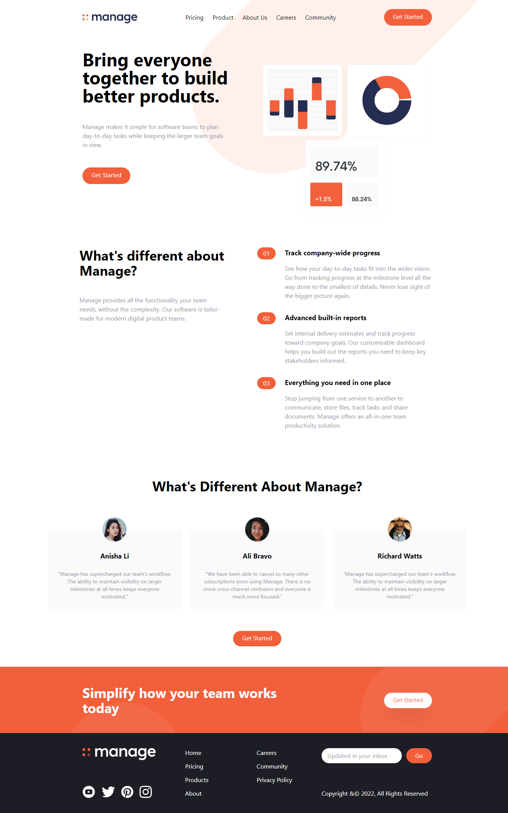

# 03 - Typealong Manage Landing Page

## Table of contents

- [Overview](#overview)
  - [Screenshot](#screenshot)
  - [Links](#links)
- [My process](#my-process)
  - [Built with](#built-with)
  - [Conclusion](#conclusion)
  - [Useful resources](#useful-resources)

## Overview

### Screenshot

### Links

- Live Site URL: [Click here](https://03-typealong-manage-landing-page.netlify.app/)

## My process

### Built with

- [TailwindCSS](https://tailwindcss.com/) - CSS Framework

### Conclusion

- A practice on tailwindcss framework.
- The framework able to improve the speed of development and uniformize css with the utilities provided.

### Useful resources

- Source Tutorial: [Click here](https://youtu.be/dFgzHOX84xQ)
